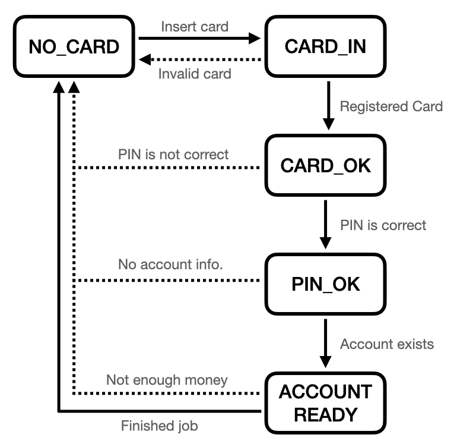
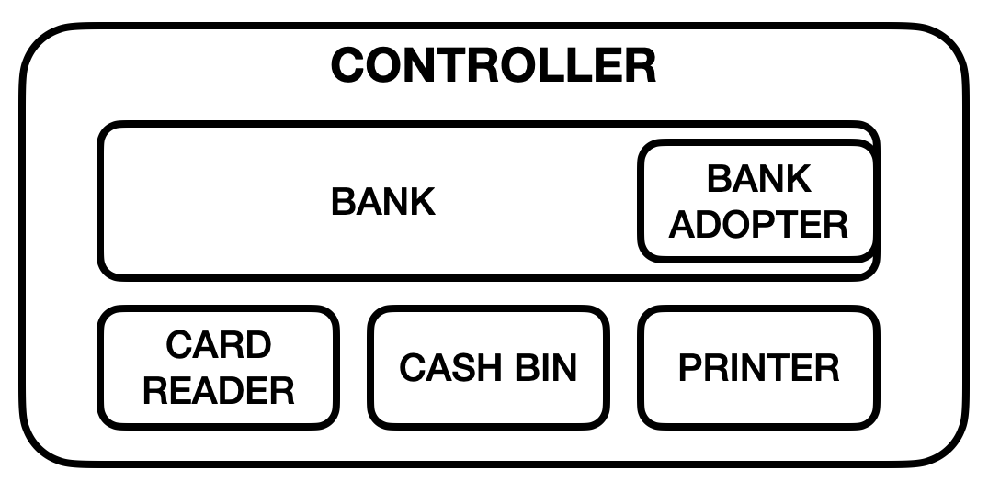

# simple ATM controller


This project is a simple ATM controller implemented by using python3.

The *pdoc* generated more documents in **./docs** using docstrings.


## Installation

**Step 1**: Requirements
- Python >= 3.8.9
- pytest >= 7.11
- git

**Step 2**: Clone the project
```shell
git clone https://github.com/lockevi/BR_custom_tasks
```

**Step 3**: Make a virtual environment and activate it
```shell
cd ./BR_custom_tasks
python3 -m venv venv
source ./venv/bin/activate
```

**Step 4**: Install some packages using pip
```shell
pip install -r ./requirements.txt
```

---


## Run and Test

***app/main.py***  : Sample code which shows some basic flow of ATM controller
```shell
export PYTHONPATH=`pwd`
cd ./app
python3 main.py
```

***tests/\*.py*** : ***pytest*** was used for a lot of test cases. Simply run ***pytest*** at directory ***./tests***.
```shell
export PYTHONPATH=`pwd`
cd ./tests
pytest
```

---


## User Scenario & Thoughts

As an ATM user, I described a series of my behaviors in order.
As an ATM developer, I also tried to consider what ATM to do at same time.

#### 0. Insert card, Enter PIN and Select an account
1. Put the card in
   - Is it registered card ?
2. Enter the PIN number
   - PIN is correct ?
3. Select account
   - Before selecting an account, **prepare** the information of **accounts list** from the bank.

#### A. Balance
4. Select "Check Balance" in the menu
5. Check the balance of the selected account
6. Get a receipt
   - **Print** a receipt
   - Flow ends. **Return** to initial state.

#### B. Deposit
4. Select "Deposit" in the menu
   - The **door** of money counter **opened**
5. Put the money in
   - The **door** of money counter **closed**
   - Count the money 
6. Check the money counted and Confirm again
   - **Update** the **account** using Bank API
   - Put the money into the cash bin
7. Get a receipt
   - **Print** a receipt
   - Flow ends. **Return** to initial state.

#### C. Withdraw
4. Select "Withdraw" in the menu
5. Input the amount of money to withdraw
   - Check amount <= balance 
   - Check amount <= available money in cash bin
   - **Update** the **account** using Bank API
   - Count the money
   - The **door** of money counter **opened**
6. Take the money
   - The **door** of money counter **closed** 
7. Get a receipt
   - **Print** a receipt
   - Flow ends. **Return** to initial state.


## More Assumptions

1. [Card] - [Bank] - [Accounts] relations
   - ONE card is linked to ONE bank only. (1:1)
   - ONE card can be linked to N accounts. (1:N)
2. The formats of card number and PIN number
   - CARD NUMBER is 8-digit number from 00000000 to 99999999.
   - PIN is 4-digit number from 0000 to 9999.
3. Simulations by the simple mock-up classes
   - Implementation of banking system is out of scope.
   - Hardwares, like card reader, cash bin, printer. .., will be defined only.
4. No PIN number in banking API or network packets
   - PIN should not be exposed in anywhere for security, 
   - Used token for access to banking API. (but hash function is not used now.)
5. Ignore event-driven functionalities
   - Detecting card insertion, Users' money moves in/out
   - Event handling is out of the scope to make a simpler problem.


## State Diagram



This simplified state diagram shows basic transition of the controller's state. More detailed states were defined in the ***[class ATMStatus](./docs/controller.html#ATMStatus)***.


## Block Diagram of ATM controller



#### [*class ATMController*](./docs/controller.html#ATMController)
- Manages almost all of functions inside the ATM
- Write a log (controller.log)
- Sends dianosis data periodically to Control Center

#### [*class Bank*](./docs/bank.html#Bank)
- Manages the properties related to banking operation, like card number, account information and etc.
- For loosely-coupling the controller and the banking APIs, ***class Bank*** wraps ***class BankAdopterInterface*** which has a bundle of real banking APIs.

#### [*class BankAdopterInterface*](./docs/adopter.html#BankAdopterInterface)
- Each bank may have its own banking APIs. But it doesn't matter to the controller if another developer implements them in inherited BankAdopter classes.

#### [*class CardReaderInterface*](./docs/cardreader.html#CardReaderInterface)
- Defines functionalities of the card reader device, like reading card number and ejecting the card.

#### [*class CashBinInterface*](./docs/cashbin.html#CashBinInterface)
- Defines functionalities of the cash bin, like open/close money counter, counting money, managing moving money in/out.
- Cash bin has a limit of amount of money to withdraw less than current amount of money in cash bin.

#### [*class PrinterInterface*](./docs/printer.html#PrinterInterface)
- Defines functionalities of the receipt printer.
- Receipt printer has a roll of paper to print and counts paper length remained.


## Test Cases

#### Hardwares
- Card Reaer : [./tests/test_cardreader.py](./docs/tests/test_cardreader.html)
- Cash Bin : [./tests/test_cashbin.py](./docs/tests/test_cashbin.html)
- Receipt Printer : [./tests/test_printer.py](./docs/tests/test_printer.html)

#### Bank
- Bank Adopter : [./tests/test_adopter.py](./docs/tests/test_adopter.html)
- Bank : [./tests/test_bank.py](./docs/tests/test_bank.html)

#### ATM Controller
- ATM Controller : [./tests/test_controller.py](./docs/tests/test_controller.html)


## Logs

The ATMController writes a log file to track the history of operations or debugging in current directory.

```shell
$ tail -30 controller.log

[INFO]	2022-04-13 13:46:26.825    INSERTED_CARD:13572468
[INFO]	2022-04-13 13:46:26.825    REGISTERED_CARD:13572468
[INFO]	2022-04-13 13:46:26.825    PIN_IS_CORRECT
[INFO]	2022-04-13 13:46:26.825    ACCOUNTS_DATA: [{'acc_num': '11113333', 'balance': 10, 'available': True}, {'acc_num': '22224444', 'balance': 50, 'available': True}]
[INFO]	2022-04-13 13:46:26.825    ACCOUNT_SELECTED: 0
[INFO]	2022-04-13 13:46:26.825    DOOR_OPENED
[INFO]	2022-04-13 13:46:26.825    DOOR_CLOSED
[INFO]	2022-04-13 13:46:26.825    MONEY_COUNTED: 10
[INFO]	2022-04-13 13:46:26.825    BANK_DEPOSIT_START
[INFO]	2022-04-13 13:46:26.825    BANK_DEPOSIT_OK
[INFO]	2022-04-13 13:46:26.825    PUSH_MONEY
[INFO]	2022-04-13 13:46:26.825    PRINT_RECEIPT
[INFO]	2022-04-13 13:46:26.825    EJECTED_CARD
[INFO]	2022-04-13 13:46:26.825    RESET

[INFO]	2022-04-13 13:46:26.825    INSERTED_CARD:13572468
[INFO]	2022-04-13 13:46:26.825    REGISTERED_CARD:13572468
[INFO]	2022-04-13 13:46:26.825    PIN_IS_CORRECT
[INFO]	2022-04-13 13:46:26.825    ACCOUNTS_DATA: [{'acc_num': '11113333', 'balance': 20, 'available': True}, {'acc_num': '22224444', 'balance': 50, 'available': True}]
[INFO]	2022-04-13 13:46:26.825    ACCOUNT_SELECTED: 1
[INFO]	2022-04-13 13:46:26.825    BANK_WITHDRAW_START
[INFO]	2022-04-13 13:46:26.825    BANK_WITHDRAW_OK
[INFO]	2022-04-13 13:46:26.825    POP_MONEY
[INFO]	2022-04-13 13:46:26.825    DOOR_OPENED
[INFO]	2022-04-13 13:46:26.825    PRINT_RECEIPT
[INFO]	2022-04-13 13:46:26.825    EJECTED_CARD
[INFO]	2022-04-13 13:46:26.826    RESET

[INFO]	2022-04-13 13:46:26.826    DOOR_CLOSED
```

